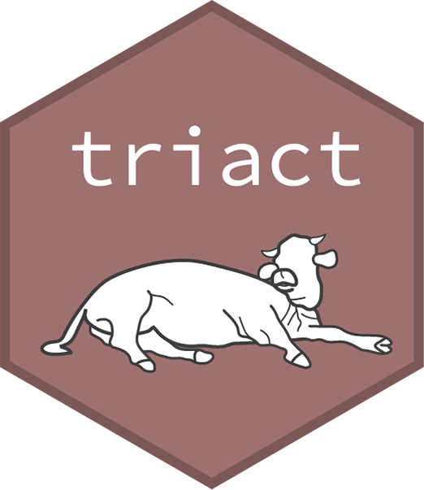

<!-- badges: start -->

[](https://cran.r-project.org/package=triact)

<!-- badges: end -->

# triact  

&nbsp;
## Overview

The triact R package assists in analyzing the lying behavior of cows from raw data recorded with a triaxial accelerometer attached to the hind leg of a cow. Background and rationale of the implemented analyses are described in detail in the following publication:

>Simmler M., Brouwers S. P., 2023. triact package for R: Analyzing the lying behavior of cows from accelerometer data, under review


## Installation
```r
# Install from CRAN (recommended)
install.packages("triact")

# Or the the development version from GitLab:
# install.packages("devtools")
devtools::install_gitlab("AgroSimi/triact", build_vignettes = TRUE)
```
## Maintainer contact 

Michael Simmler, Agroscope ([Link](https://ira.agroscope.ch/en-US/person/19776))


