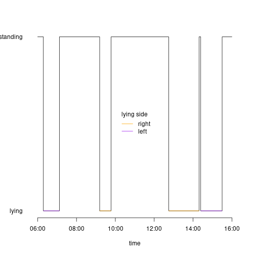

\
This vignette contains executable examples for the intended use of the R package *triact*. With a few exceptions, the functionalities are presented with default parameters only. We recommend that you also read the help page to learn more about the many parameters that can be used to customize the behavior of the methods in *triact*. Furthermore, we detailed the background and rationale of the implemented analyses in the following publication:\

> Simmler M., Brouwers S., 2023. *triact package for R: Analyzing the lying behavior of cows from accelerometer data*, in preparation


## Setup


```{r, include = FALSE}
library(triact)
```

\
Since *triact* is intended for data with sampling frequency of \>1 Hz, it is advisable to adjust R's global option `digits.secs`, which specifies the maximum number of digits to print when formatting time values in seconds (default is 0).\


```r
options(digits.secs = 3)
```

\
Via the global option `triact_table` the type of tables returned by *triact* can be specified. Options are `"data.frame"` (the default), `"tibble"`, and `"data.table"`.\


```r
options(triact_table = "data.frame")
```

## Getting help

  All functionalities of the *triact* R package are documented on the help page of the `Triact` R6 class.\


```r
?Triact
```

\newpage

## Getting and inspecting the example data

The example data can be downloaded from <https://gitlab.com/AgroSimi/triact_example_data>. The data includes four raw data files from triaxial accelerometers (MSR145, MSR Electronics, Switzerland) attached to the left hind leg of dairy cows. The sampling frequency was 20 Hz. Each file represents one day of recording of one cow.\


```r
dir <-  "example_data" # adjust (path to the downloaded example data)

files <- list.files(dir)

print(files)
```

```
## [1] "2021-06-29_013_A.csv" "2021-06-29_055_A.csv" "2021-06-29_059_A.csv" "2021-06-29_063_A.csv"
```

\
Inspecting one of the files reveals a file header and the semicolon-separated data starting after the line with `"*Data`". This is an example of how files imported by *triact* might look. However, *triact* can handle any kind of delimiter-separated text files.\


```r
cat(paste(readLines(file.path(dir, files[1]), n = 30), collapse = "\n"))
```

```
## *CREATOR
## msr_cutter.exe;[V6.06.02]
## msr2csv.exe;[V6.06.02]
##
## *STARTTIME
## 2021-06-29;06:00:00;
##
## *MODUL
## NAME;MSR314553;MSR314553;MSR314553
## *NAME
## NAME;6A;6A;6A
##
## ID;[C26113 V5.66];[C26113 V5.66];[C26113 V5.66]
##
## *CHANNEL
## TIME;ACC x;ACC y;ACC z
##
## *UNIT
## ;G;G;G
##
## *LIMITS
## ALARM;;;
## RECRD;;;
## LIMIT1;;;
## LIMIT2;;;
##
## *DATA
## 2021-06-29 06:00:00.055;-0.048;1.032;-0.063
## 2021-06-29 06:00:00.105;-0.048;1.032;-0.031
## 2021-06-29 06:00:00.156;-0.048;1.032;-0.063
```

## Importing data

The typical *triact* workflow starts by creating a new object of the `Triact` class.\


```r
my_triact <- Triact$new()
```

\
Acceleration data is then imported into the `Triact` object (here named 'my_triact'). Using the `$load_files()` method the data from raw data files can be imported. This method has many arguments, which allow adapting the behavior to read the specific format of the delimiter-separated data file. Important for correct processing of the files are `id_substring` and `timeFwdUpRight_cols`. The first specifies the substring of the file names that uniquely identifies the cows, while the latter maps the columns as found in the file to the *time*, *forward* acceleration, *up* acceleration, and *right* acceleration as understood by *triact*. Notes: Alternatively, you can read your files with your own routine and then use the `$load_table` method to import a data.frame into the `Triact` object. If you suspect that you have accidentally placed the accelerometers rotated by 180° in the sagittal plane, you can get help with `$check_orientation()`.

\


```r
my_triact$load_files(input = dir,
                     id_substring = c(12, 14),
                     timeFwdUpRight_cols = c(1, 2 ,3, 4),
                     skip = "*DATA")
```

\
Imported raw data and added analyses can be accessed between any step of the workflow via the `$data` field.\


```r
head(my_triact$data)
```

```
##    id                time acc_fwd acc_up acc_right
## 1 013 2021-06-29 06:00:00  -0.048   1.03    -0.063
## 2 013 2021-06-29 06:00:00  -0.048   1.03    -0.031
## 3 013 2021-06-29 06:00:00  -0.048   1.03    -0.063
## 4 013 2021-06-29 06:00:00  -0.079   1.00    -0.063
## 5 013 2021-06-29 06:00:00  -0.048   1.00    -0.063
## 6 013 2021-06-29 06:00:00  -0.048   1.00    -0.031
```

\


```r
str(my_triact$data)
```

```
## 'data.frame':	2835692 obs. of  5 variables:
##  $ id       : Factor w/ 4 levels "013","055","059",..: 1 1 1 1 1 1 1 1 1 1 ...
##  $ time     : POSIXct, format: "2021-06-29 06:00:00.055" "2021-06-29 06:00:00.105" "2021-06-29 06:00:00.155" "2021-06-29 06:00:00.207" ...
##  $ acc_fwd  : num  -0.048 -0.048 -0.048 -0.079 -0.048 -0.048 -0.048 -0.048 -0.048 -0.048 ...
##  $ acc_up   : num  1.03 1.03 1.03 1 1 ...
##  $ acc_right: num  -0.063 -0.031 -0.063 -0.063 -0.063 -0.031 -0.031 -0.031 -0.063 -0.063 ...
```

\newpage

## Adding analyses

\
Calling add_... methods triggers analyses of lying behavior and the calculation of proxies for the level of physical activity. These analyses are obtained for each time point of your acceleration data and added in a new column to the tabular data in the `Triact` object.

### Detecting standing and lying posture

The `$add_lying()` method performs the classification into lying and standing. The results are (silently) added to the data in the `Triact` object as a column named *lying*.\


```r
my_triact$add_lying()
```

### Detecting lying laterality

The `$add_side()` method performs the determination of lying laterality (left/right lying side). The results are (silently) added to the data in the `Triact` object as a column named *side*. Crucial for correct determination of the lying side is the correct specification of the hind leg the accelerometer was mounted on (parameter `left_leg = TRUE` for left, or `FALSE` for right).\


```r
my_triact$add_side(left_leg = TRUE)
```

### Calculating proxies for the physical activity level

The `$add_activity()` method performs the calculation of proxies for the physical activity level of the cow(s). By default, the L2 norm of the vector of the dynamic body acceleration is calculated, and 'adjusted' to  a value of zero during lying bouts (AdjL2DBA). See `?Triact` and Simmler & Brouwers (2023) for more information on the available proxies for the physical activity level.
\


```r
my_triact$add_activity()
```

\
The data in the `Triact` object now additionally contains the added analyses (last three columns).\


```r
str(my_triact$data)
```

```
## 'data.frame':	2835692 obs. of  9 variables:
##  $ id       : Factor w/ 4 levels "013","055","059",..: 1 1 1 1 1 1 1 1 1 1 ...
##  $ time     : POSIXct, format: "2021-06-29 06:00:00.055" "2021-06-29 06:00:00.105" "2021-06-29 06:00:00.155" "2021-06-29 06:00:00.207" ...
##  $ acc_fwd  : num  -0.048 -0.048 -0.048 -0.079 -0.048 -0.048 -0.048 -0.048 -0.048 -0.048 ...
##  $ acc_up   : num  1.03 1.03 1.03 1 1 ...
##  $ acc_right: num  -0.063 -0.031 -0.063 -0.063 -0.063 -0.031 -0.031 -0.031 -0.063 -0.063 ...
##  $ bout_nr  : num  1 1 1 1 1 1 1 1 1 1 ...
##  $ lying    : logi  FALSE FALSE FALSE FALSE FALSE FALSE ...
##  $ side     : Factor w/ 2 levels "L","R": NA NA NA NA NA NA NA NA NA NA ...
##  $ AdjL2DBA : num  0.0453 0.032 0.0453 0.0446 0.032 ...
##  - attr(*, "index")= int(0)
##   ..- attr(*, "__lying")= int [1:2835692] 1 2 3 4 5 6 7 8 9 10 ...
```

\newpage

\
The *triact* package does not come with visualization capabilities. But the data can easily be accessed and plotted with base R or packages dedicated to graphics (e.g. ggplot2). The following example shows how to access the data of a single cow (here with ID 013) and to visualize the lying behavior.\


```r
cow_id = "013"

data_013 <- my_triact$data[my_triact$data$id == cow_id, ]

plot(!lying ~ time, data = data_013,
     type = "l", ylab = "", yaxt = "n", bty = "n")

lines(ifelse(side == "R", 0, NA) ~ time, data = data_013, col = "orange")
lines(ifelse(side == "L", 0, NA) ~ time, data = data_013, col = "purple")

axis(2, at = c(0, 1),
     labels = c("lying", "standing"),
     las = 1,
     lwd = 0)

legend(x = "center",
       legend = c("right", "left"),
       col = c("orange", "purple"),
       lwd = 1, bty = "n", title = "lying side")
```

{width=350px}

\

\newpage

## Summarizing results

Using the $summarize... methods the analyses added to the `Triact` object is summarized per time period, which represent either the standing/lying bouts or regular intervals, e.g. 1 h or 24 h.

### Summarizing per lying/standing bout

With `$summarize_bouts()` a summary is created for the individual lying and standing bouts, with duration, mean activity, and lying side (for a lying bout). In the output we see that the first bout per cow is not completely observed (`startTime` is missing) and therefor NAs are returned for measures such as duration. See parameter `calc_for_incomplete`in case you want to change this behavior.
\


```r
bouts_summary <- my_triact$summarize_bouts()
```


```r
head(bouts_summary)
```

```
##    id bout_nr           startTime             endTime duration lying side meanAdjL2DBA
## 1 013       1                <NA> 2021-06-29 06:17:40       NA FALSE <NA>           NA
## 2 013       2 2021-06-29 06:17:40 2021-06-29 07:07:16     49.6  TRUE    L       0.0000
## 3 013       3 2021-06-29 07:07:16 2021-06-29 09:11:33    124.3 FALSE <NA>       0.2062
## 4 013       4 2021-06-29 09:11:33 2021-06-29 09:46:51     35.3  TRUE    R       0.0000
## 5 013       5 2021-06-29 09:46:51 2021-06-29 12:44:45    177.9 FALSE <NA>       0.0839
## 6 013       6 2021-06-29 12:44:45 2021-06-29 14:18:30     93.7  TRUE    R       0.0000
```
\
If only the lying bouts are of interest, the `bout_type` parameter can be specified accordingly.
\

```r
bouts_summary <- my_triact$summarize_bouts(bout_type = "lying")
```


```r
head(bouts_summary)
```

```
##    id bout_nr           startTime             endTime duration lying side meanAdjL2DBA
## 1 013       2 2021-06-29 06:17:40 2021-06-29 07:07:16     49.6  TRUE    L            0
## 2 013       4 2021-06-29 09:11:33 2021-06-29 09:46:51     35.3  TRUE    R            0
## 3 013       6 2021-06-29 12:44:45 2021-06-29 14:18:30     93.7  TRUE    R            0
## 4 013       8 2021-06-29 14:23:36                <NA>       NA  TRUE    L           NA
## 5 055       1                <NA> 2021-06-29 07:07:26       NA  TRUE    R           NA
## 6 055       3 2021-06-29 12:56:42 2021-06-29 14:38:00    101.3  TRUE    R            0
```
\newpage
### Summarizing per regular intervals

With `$summarize_intervals()` the summary is obtained per regular intervals, by default per hour.\


```r
int_summary <- my_triact$summarize_intervals()
```
\
The NAs in the output are a result of incompletely observed intervals (first and last interval of each cow) and of dependencies of measures on information of incompletely observed bouts (can also affect second and further intervals). See parameter `calc_for_incomplete` in case you want to change this behavior. The NaN on the other hand do not indicate missing information: For example, if the cow was not standing in the interval, the mean activity during standing is not zero, but cannot be calculated (thus NaN, "not a number").
\

```r
head(int_summary)
```

```
##    id           startTime          centerTime             endTime duration durationStanding durationLying
## 1 013 2021-06-29 06:00:00 2021-06-29 06:30:00 2021-06-29 07:00:00       NA               NA            NA
## 2 013 2021-06-29 07:00:00 2021-06-29 07:30:00 2021-06-29 08:00:00       60             52.7          7.27
## 3 013 2021-06-29 08:00:00 2021-06-29 08:30:00 2021-06-29 09:00:00       60             60.0          0.00
## 4 013 2021-06-29 09:00:00 2021-06-29 09:30:00 2021-06-29 10:00:00       60             24.7         35.31
## 5 013 2021-06-29 10:00:00 2021-06-29 10:30:00 2021-06-29 11:00:00       60             60.0          0.00
## 6 013 2021-06-29 11:00:00 2021-06-29 11:30:00 2021-06-29 12:00:00       60             60.0          0.00
##   durationLyingLeft durationLyingRight meanAdjL2DBA meanAdjL2DBALying meanAdjL2DBAStanding
## 1                NA                 NA           NA                NA                   NA
## 2              7.27                0.0       0.2363                 0                0.269
## 3              0.00                0.0       0.1668               NaN                0.167
## 4              0.00               35.3       0.0474                 0                0.115
## 5              0.00                0.0       0.1014               NaN                0.101
## 6              0.00                0.0       0.0610               NaN                0.061
```


```r
str(int_summary)
```

```
## 'data.frame':	41 obs. of  12 variables:
##  $ id                  : Factor w/ 4 levels "013","055","059",..: 1 1 1 1 1 1 1 1 1 1 ...
##  $ startTime           : POSIXct, format: "2021-06-29 06:00:00" "2021-06-29 07:00:00" "2021-06-29 08:00:00" "2021-06-29 09:00:00" ...
##  $ centerTime          : POSIXct, format: "2021-06-29 06:30:00" "2021-06-29 07:30:00" "2021-06-29 08:30:00" "2021-06-29 09:30:00" ...
##  $ endTime             : POSIXct, format: "2021-06-29 07:00:00" "2021-06-29 08:00:00" "2021-06-29 09:00:00" "2021-06-29 10:00:00" ...
##  $ duration            : num  NA 60 60 60 60 ...
##  $ durationStanding    : num  NA 52.7 60 24.7 60 ...
##  $ durationLying       : num  NA 7.27 0 35.31 0 ...
##  $ durationLyingLeft   : num  NA 7.27 0 0 0 ...
##  $ durationLyingRight  : num  NA 0 0 35.3 0 ...
##  $ meanAdjL2DBA        : num  NA 0.2363 0.1668 0.0474 0.1014 ...
##  $ meanAdjL2DBALying   : num  NA 0 NaN 0 NaN NaN 0 0 0 0 ...
##  $ meanAdjL2DBAStanding: num  NA 0.269 0.167 0.115 0.101 ...
##  - attr(*, "index")= int(0)
##   ..- attr(*, "__startTime")= int [1:41] 1 12 22 32 2 13 23 33 3 14 ...
```

\newpage
The intervals can be specified quite flexibly: In case of 30 min intervals and starting 10 min after the full hour we can specify `interval` and `lag_in_s` parameters accordingly.
\

```r
int_summary <- my_triact$summarize_intervals(interval = "30 min",
                                             lag_in_s = 10 * 60)
```


```r
head(int_summary)
```

```
##    id           startTime          centerTime             endTime duration durationStanding durationLying
## 1 013 2021-06-29 05:40:00 2021-06-29 05:55:00 2021-06-29 06:10:00       NA               NA            NA
## 2 013 2021-06-29 06:10:00 2021-06-29 06:25:00 2021-06-29 06:40:00       30             7.67          22.3
## 3 013 2021-06-29 06:40:00 2021-06-29 06:55:00 2021-06-29 07:10:00       30             2.73          27.3
## 4 013 2021-06-29 07:10:00 2021-06-29 07:25:00 2021-06-29 07:40:00       30            30.00           0.0
## 5 013 2021-06-29 07:40:00 2021-06-29 07:55:00 2021-06-29 08:10:00       30            30.00           0.0
## 6 013 2021-06-29 08:10:00 2021-06-29 08:25:00 2021-06-29 08:40:00       30            30.00           0.0
##   durationLyingLeft durationLyingRight meanAdjL2DBA meanAdjL2DBALying meanAdjL2DBAStanding
## 1                NA                 NA           NA                NA                   NA
## 2              22.3                  0       0.0338                 0                0.132
## 3              27.3                  0       0.0557                 0                0.612
## 4               0.0                  0       0.2715               NaN                0.271
## 5               0.0                  0       0.2067               NaN                0.207
## 6               0.0                  0       0.1747               NaN                0.175
```


```r
str(int_summary)
```

```
## 'data.frame':	84 obs. of  12 variables:
##  $ id                  : Factor w/ 4 levels "013","055","059",..: 1 1 1 1 1 1 1 1 1 1 ...
##  $ startTime           : POSIXct, format: "2021-06-29 05:40:00" "2021-06-29 06:10:00" "2021-06-29 06:40:00" "2021-06-29 07:10:00" ...
##  $ centerTime          : POSIXct, format: "2021-06-29 05:55:00" "2021-06-29 06:25:00" "2021-06-29 06:55:00" "2021-06-29 07:25:00" ...
##  $ endTime             : POSIXct, format: "2021-06-29 06:10:00" "2021-06-29 06:40:00" "2021-06-29 07:10:00" "2021-06-29 07:40:00" ...
##  $ duration            : num  NA 30 30 30 30 ...
##  $ durationStanding    : num  NA 7.67 2.73 30 30 ...
##  $ durationLying       : num  NA 22.3 27.3 0 0 ...
##  $ durationLyingLeft   : num  NA 22.3 27.3 0 0 ...
##  $ durationLyingRight  : num  NA 0 0 0 0 ...
##  $ meanAdjL2DBA        : num  NA 0.0338 0.0557 0.2715 0.2067 ...
##  $ meanAdjL2DBALying   : num  NA 0 0 NaN NaN NaN NaN 0 0 NaN ...
##  $ meanAdjL2DBAStanding: num  NA 0.132 0.612 0.271 0.207 ...
##  - attr(*, "index")= int(0)
##   ..- attr(*, "__startTime")= int [1:84] 1 22 43 64 2 23 44 65 3 24 ...
```
\
\newpage
With `bouts == TRUE` we can request that, additionally, the bouts within the intervals are summarized. For measures such as the number of lying bouts or mean lying bout duration, a weighted mean is calculated with the weights being the proportion of the individual bout overlapping with the respective interval. With `side = TRUE` we can additionally request a differentiation of all results by lying side.
\

```r
int_summary <- my_triact$summarize_intervals(bouts = TRUE,
                                             side = TRUE)
```


```r
str(int_summary)
```

```
## 'data.frame':	41 obs. of  22 variables:
##  $ id                         : Factor w/ 4 levels "013","055","059",..: 1 1 1 1 1 1 1 1 1 1 ...
##  $ startTime                  : POSIXct, format: "2021-06-29 06:00:00" "2021-06-29 07:00:00" "2021-06-29 08:00:00" "2021-06-29 09:00:00" ...
##  $ centerTime                 : POSIXct, format: "2021-06-29 06:30:00" "2021-06-29 07:30:00" "2021-06-29 08:30:00" "2021-06-29 09:30:00" ...
##  $ endTime                    : POSIXct, format: "2021-06-29 07:00:00" "2021-06-29 08:00:00" "2021-06-29 09:00:00" "2021-06-29 10:00:00" ...
##  $ duration                   : num  NA 60 60 60 60 ...
##  $ durationStanding           : num  NA 52.7 60 24.7 60 ...
##  $ durationLying              : num  NA 7.27 0 35.31 0 ...
##  $ durationLyingLeft          : num  NA 7.27 0 0 0 ...
##  $ durationLyingRight         : num  NA 0 0 35.3 0 ...
##  $ meanAdjL2DBA               : num  NA 0.2363 0.1668 0.0474 0.1014 ...
##  $ meanAdjL2DBALying          : num  NA 0 NaN 0 NaN NaN 0 0 0 0 ...
##  $ meanAdjL2DBAStanding       : num  NA 0.269 0.167 0.115 0.101 ...
##  $ meanAdjL2DBALyingLeft      : num  NA 0 NaN NaN NaN NaN NaN NaN 0 0 ...
##  $ meanAdjL2DBALyingRight     : num  NA NaN NaN 0 NaN NaN 0 0 0 NaN ...
##  $ nBoutsStanding             : num  NA 0.424 0.483 0.167 0.337 ...
##  $ nBoutsLying                : num  NA 0.147 0 1 0 ...
##  $ nBoutsLyingLeft            : num  NA 0.147 0 0 0 ...
##  $ nBoutsLyingRight           : num  NA 0 0 1 0 ...
##  $ wMeanDurationStandingBout  : num  NA 124 124 148 178 ...
##  $ wMeanDurationLyingBout     : num  NA 49.6 NaN 35.3 NaN ...
##  $ wMeanDurationLyingBoutLeft : num  NA 49.6 NaN NaN NaN ...
##  $ wMeanDurationLyingBoutRight: num  NA NaN NaN 35.3 NaN ...
##  - attr(*, "index")= int(0)
##   ..- attr(*, "__startTime")= int [1:41] 1 12 22 32 2 13 23 33 3 14 ...
```

\newpage
## Extracting posture transitions

Using `$extract_liedown()` and `$extract_standup()`, the raw acceleration data (and added analyses) of the posture transitions, i.e., lying-to-standing and standing-to-lying, can be extracted.

With default parameters, only the time of the transition, bout nr of the lying bout, and lying side (if available) is returned.

```r
st_ups <- my_triact$extract_standup()
```

```r
print(st_ups)
```

```
##     id                time bout_nr side
## 1  013 2021-06-29 07:07:16       2    L
## 2  013 2021-06-29 09:46:51       4    R
## 3  013 2021-06-29 14:18:29       6    R
## 4  013 2021-06-29 15:29:43       8    L
## 5  055 2021-06-29 07:07:26       1    R
## 6  055 2021-06-29 14:38:00       3    R
## 7  055 2021-06-29 15:42:59       5    L
## 8  059 2021-06-29 07:06:17       2    R
## 9  059 2021-06-29 14:20:57       4    L
## 10 063 2021-06-29 06:33:14       1    R
## 11 063 2021-06-29 09:48:17       3    R
## 12 063 2021-06-29 10:12:38       5    R
## 13 063 2021-06-29 13:50:07       7    R
## 14 063 2021-06-29 15:47:53       9    R
```

When specifying 'sec_before' and 'sec_after`, time series around the exact moment of posture transition as detected by *triact* are returned. The result is a list with tables (one table per posture transition).


```r
l_downs <- my_triact$extract_liedown(sec_before = 3, sec_after = 3)
```
\

```r
head(l_downs[[1]])
```

```
##    id                time acc_fwd acc_up acc_right bout_nr lying side AdjL2DBA
## 1 013 2021-06-29 06:17:37  -0.206  1.000    -0.094       1 FALSE <NA>   0.0549
## 2 013 2021-06-29 06:17:37  -0.206  1.000    -0.094       1 FALSE <NA>   0.0549
## 3 013 2021-06-29 06:17:37  -0.238  1.000    -0.063       1 FALSE <NA>   0.0698
## 4 013 2021-06-29 06:17:37  -0.238  0.968    -0.031       1 FALSE <NA>   0.0940
## 5 013 2021-06-29 06:17:37  -0.238  0.968    -0.031       1 FALSE <NA>   0.0940
## 6 013 2021-06-29 06:17:37  -0.206  1.000    -0.063       1 FALSE <NA>   0.0768
```


